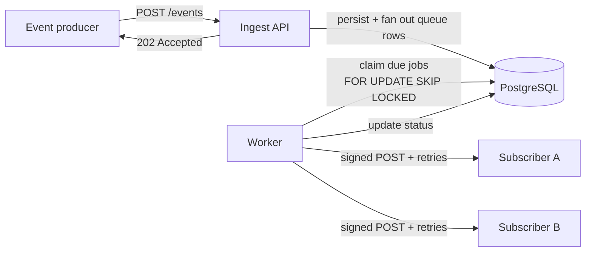

# Webhook Delivery Service — V1

A reliable, asynchronous webhook fan-out system. Ingest events fast, deliver
them to subscriber URLs out-of-band with retries, idempotency, and HMAC signing.

## The one-line mental model

An event comes in → it's persisted and the API immediately returns **202 Accepted**
→ a background **worker** reliably fans it out to every subscribed URL, retrying
on failure. Ingest latency stays in single-digit milliseconds no matter how slow
the receivers are. That decoupling is the whole point.

## Architecture



The `deliveries` table **is** the job queue. The API writes jobs; the worker
drains them. They share nothing but the database.

## Data model

| table | purpose | notes |
|---|---|---|
| `subscriptions` | who wants which events, where to send them | holds the per-sub HMAC `secret` |
| `events` | the incoming events | `idempotency_key` is `UNIQUE` |
| `deliveries` | one row per (event → subscription) attempt set | **this is the queue** |

See `db/migrations/0001_init.sql` for the full DDL and the index reasoning.

## Setup

You already have Node 24, PostgreSQL, and the `webhook_app` / `webhook_dev`
role+db from the environment setup.

```bash
npm install
cp .env.example .env
# edit .env: set DATABASE_URL password + a long random API_KEY
npm run migrate
```

Generate a decent API key with: `node -e "console.log(require('crypto').randomBytes(24).toString('hex'))"`

## Running (3 terminals)

```bash
npm run receiver   # 1) the test target on :4000
npm run worker     # 2) the delivery worker
npm run dev        # 3) the ingest API on :3000
```

## End-to-end test

Use `requests.http` (VS Code REST Client) or curl:

1. `POST /subscriptions` with `target_url: http://localhost:4000/hook` → note the `id` and `secret`.
2. `POST /events` with matching `event_type` → get back `202` + an `event_id`.
3. Watch the worker terminal deliver it; the receiver logs the signed payload.
4. `GET /events/:id/deliveries` → status `succeeded`.

To see **retries + dead-letter**, create a subscription pointing at
`http://localhost:4000/hook?fail=1` and ingest a matching event — watch
`attempt_count` climb and `next_attempt_at` push out, then flip to `dead` after
`MAX_ATTEMPTS`.

To verify **signatures**, restart the receiver with the subscription's secret:
`RECEIVER_SECRET=<secret> npm run receiver`.

## API

All endpoints except `/health` require header `x-api-key: <API_KEY>`.

| method | path | purpose |
|---|---|---|
| GET | `/health` | liveness (no auth) |
| POST | `/subscriptions` | create a subscription (returns the secret once) |
| GET | `/subscriptions` | list |
| GET | `/subscriptions/:id` | fetch one |
| DELETE | `/subscriptions/:id` | remove |
| POST | `/events` | **ingest** (202); pass `Idempotency-Key` header to dedupe |
| GET | `/events/:id` | fetch the event |
| GET | `/events/:id/deliveries` | delivery log — "what happened to this event?" |

## Design decisions (the part worth talking about)

**Postgres as the queue (`SELECT ... FOR UPDATE SKIP LOCKED`).** No extra
infrastructure for V1. `SKIP LOCKED` lets multiple workers pull *disjoint*
batches without coordinating — a locked row is skipped, not waited on. Each
claim flips rows to `delivering` so they vanish from other workers' polls.

**Partial index on the hot path.** The worker query filters
`status='pending' AND next_attempt_at <= now()`. `deliveries_due_idx` indexes
`next_attempt_at` *only for pending rows*, so the poll stays fast and the index
stays small even as millions of `succeeded`/`dead` rows accumulate.

**Idempotency at two levels.** `events.idempotency_key` is `UNIQUE` (client
retries don't duplicate the event), and `deliveries (event_id, subscription_id)`
is `UNIQUE` (fan-out can't double-create a job).

**Exponential backoff + full jitter.** Retries spread out in time so a fleet of
failures to one recovering endpoint doesn't stampede it (thundering herd).

**HMAC-SHA256 over `timestamp.body`.** Receivers verify authenticity *and* can
reject replays by checking the timestamp. Verification uses a constant-time
compare.

**Dead-letter.** After `MAX_ATTEMPTS` a delivery is marked `dead` and left alone
— failures don't retry forever.

**Stale-lock reaper.** If a worker crashes mid-delivery, its rows would be stuck
in `delivering`. The worker resets any `delivering` row whose lock is older than
`WORKER_STALE_LOCK_MS` back to `pending`.

## Known V1 tradeoffs (deliberately deferred)

- **Long-batch behavior**: the whole batch is processed per tick; tuning
  `WORKER_BATCH_SIZE` matters under load. Per-subscription concurrency caps are V2.
- **No per-subscription rate limiting / circuit breaker** — V2.
- **No ordering guarantees** — ordering + retries genuinely conflict; that's V3.
- **At-least-once delivery**: a crash after sending but before the status UPDATE
  can re-deliver. Receivers should be idempotent (that's why we send a stable
  `x-webhook-id`).
